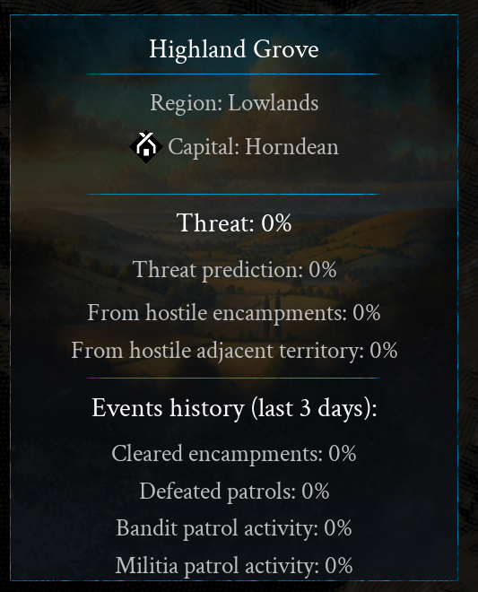
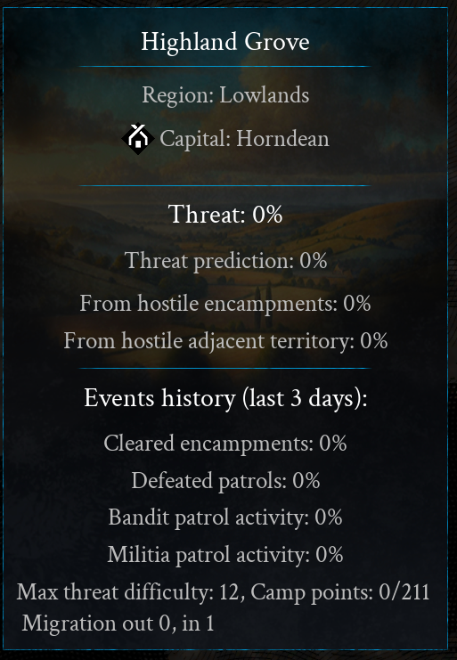
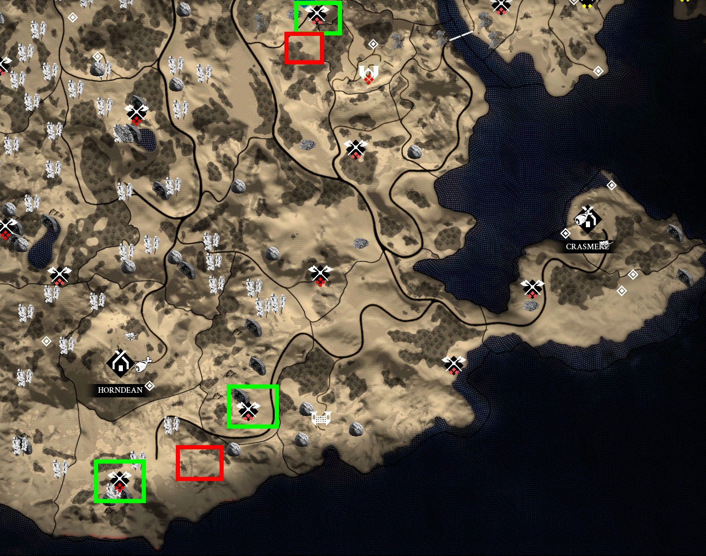
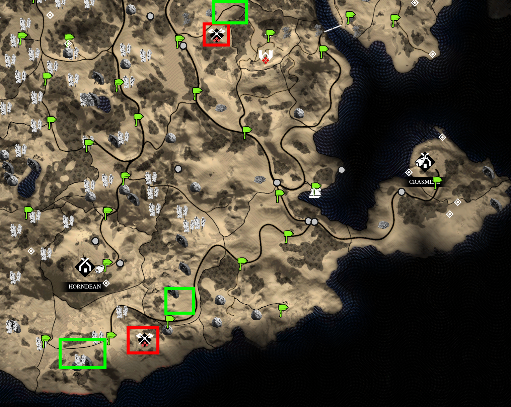

# Bandits (Data)

## Data 1 - Preview Branch Changelog (Nov. 2024)
*Source:*  
https://steamcommunity.com/app/1812450/discussions/0/4634860720019833781/

A part of the whole post treats the bandit topic:
>...  
>Villages 2.0
>
>After liberation, villages gain a "Prosperity" bar, unlocking a stronger Militia that patrols against bandits and occasionally aids the player. Prosperity grows with village improvements and clearing threats but declines if threats go unchecked.
>
>Each region now has a dynamic threat level influenced by bandit camps, patrols, and the threat in adjacent regions, affecting patrol difficulty and migration
>
>Camps now send migration parties to nearby areas when threat is high enough, forming stronger camps as prosperity rises, while migration frequency decreases as regions become populated with camps
>
>Militia from neutral villages can now be temporarily called to arms, >strengthened and upgraded as prosperity grows and Village improvements are >built, and will start sending patrols when their numbers are large enough.  
>...

**Remark:**  
Seems like the village militia patrolling against bandits doesn't happen anymore or it is extremely rare. Such a patrol was never observed in the regional map info.

## Data 2 - Map Infos about Threat
Normally the map shows region infos like this:

- **(Current) Threat:**  
  Unclear what it is. Is this actually some kind of prosperity for bandits, or also a chance of meeting a bandit? Or an indicator of how much possible threat within that region was reached (via camps and patrols)?

  Clear is: It rises with more bandit presence mostly with camps. Bandit patrols and adjacent territory have a small influence, while camps have stronger and long lasting impact. So threat is definitely an indicator for bandit presence though the question of what the percentage is relative to is never answered anywhere.

- **Threat prediction:**  
  Tells where the threat will be over time if nothing changes. Especially camps within that region are the main influence for this. They make sure a corresponding threat will be reached over time.

- **Hostile Encampments:**  
  Camps do give a fixed bonus to threat but not suddenly, instead they steadily contribute an increase to the regions threat until their number "From hostile encampments" is reached. A single tier 3 camp gives +20% for example. If a patrol is defeated in the region and thus the current threat goes down about 12% (this happens immediately): The camp will make sure the threat is back at 20% over time at some point.

- **Cleared encampments and defeated patrols:**  
  A tier 3 encampment contributes `+20%` to threat. Clearing it removes that amount of threat instantly. Same goes for patrols that were defeated **in that region**. Patrols from tier 3 camps reduce threat about 9-12%.

- **Bandit patrol activity:**  
  Seems to increase with the number of patrols and time they spend in a region. Patrols don't need to be from camps in that region to increase it.

## Data 3 - Inspect the Map with Cheats
Launching the game with the `-cheats` option and in game using `ShowSubregionAdditionalInfo 1` you are shown additional data to the threat info about regions:

- There is a **max. threat difficulty** ranging from 0 (Hearndean) to 16 (Hollow Creek and Crescent Valley)  
**Interpretation:**  
Unknown that exactly it means.

- Each region has a current and max. number of **camp points**. For example Hillside had 10/144 when inspecting it while it had a bandit camp. The northern regions (low lands) seem to have about only half of the maximal camp points the southern regions have.  
**Interpretation:**  
It is unclear what role they play. It was observed that when switching bandit migration from 'none' to 'medium' camp points for several regions in the south increased immediately from 0 to 10 or 14. Whereas at "none" they'd stay at 0 indefinitely. Camps were also created in regions with 0 camp points but as soon a the camp is created the camp points in that region rose to at least 10.

- There is a out/in migration each between 0 and 1 per region. Brigands HQ has 1/1 so perhaps this makes it impossible for camps to spawn there. When all camps are destroyed each region normally seems to get 0/1. So no out migration and full in migration. In regions where a camp exists out migration was seen to range from 0 to almost 1 but never 1.  
**Interpretation:**  
Unknown and correlating effects could not be found yet.

## Data 4 - Bandit Camp Positions
Starting a new game, using `RevealMapFog` shows all bandit camps. A screenshot was made.

At a late stage of the game a screenshot of the same region was made also having some bandit camps. But these camps did spawn after the originals in those regions had been claimed.

Screenshots:  
1) Initial game is missing the locations marked with red.  

2) Later game has the red locations, the green ones were claimed at some point.

Comparing both screenshots it turns out: The position of the new camps was quite different, so the positions are either not fixed or do have many alternatives. In general one should not rely on the initial/original camp positions to define 1:1 future camps respawning.

## Test 1 - Creation of Bandit Camps
**Intention:**  
Bandit camps are created by *bandit migration parties*. How long does it take for a bandit migration party to create a bandit camp how does that work?

**Test setup:**  
All bandit camps were removed and migrations set to 'none' for a while. Then back to "high bandit migration frequency".

**Results:**  
Actual Spawning Location:  
- About 8 hrs (in game) after migration was enabled two camps spawned in different regions. The first camp 4 hrs earlier than the second one. Loading a state where migrations were just enabled and waiting again for that time let the camps spawn in a different regions.

- Saving some hours after switching migrations on and waiting: The camps kept popping up in identical locations. So it seems the migration parties are not spawned immediately but once they spawn they have a fixed destination. So loading a state before the migration party is created can alter their destination.

- A migration party was observed at such a spot that was known to be spawning a camp soon. Once they arrived and spawned the camp, the migration party walks away and leave the camp empty. It doesn't increase the bandit patrol statistics and seems to vanish at some point. The camp stays empty after being build by the migration party. 

- If the migration party is seen in game but settings are changed to 'migration frequency = none' the migration party instantly disappears even when within the range of 200 m of the player.

  Also check the actual footage of the process: [Video of a bandit migration spawning a camp](../resources/bandit-migration_low-quality.mp4)

**Conclusion:**  
 Initially two migration parties were created 4 hrs one after another. These then walk to a destination and create a camp there. The destination is fixed the moment they spawn but is variable before. The party seems to be abandoned after camp creation and is lost. The camp is initially empty. When switching back to 'migration frequency = none' all migration parties that have not created a camp disappear (so camps can't spawn after that setting was selected!).

## Test 2 - Migration Frequency
**Intention:**  
Are the migration frequency and threat development speed via encampments correlated or is migration independent of threat?
At least that is what the village 2.0 post said:  
> Camps now send migration parties to nearby areas when threat is high enough

**Test setup:**  
* After two initial tier 3 camps spawned, check the time each needs to reach threat level 10%. Do this for all frequencies (low, medium and high).

* After that the time (days) is measured from initial camps to offspring camps.

**Results:**  
Time is given as in-game time. All times were rounded to the nearest 15 min.

Time to 20% threat (tier 3 camps):
Migration Frequency | Start | End | Time needed
--- | ---    | --- | ---
| **Camp 1**
low    | 6:30 | 19:55 | 12:30
medium | 6:30 | 19:30 | 13:00
high   | 6:30 | 19:15 | 12:45
| **Camp 2**
low    | 10:30 | 24:00 | 14:00
medium | 10:30 | 22:30 | 12:00
high   | 10:30 | 23:45 | 13:15

Time to next migration:
Migration Frequency | Start | End | Time needed
--- | ---    | --- | ---
| **Camp 1** 
low    | 6:30, day 307 | 22:00, day 316 | 231:30
medium | 6:30, day 307 | 22:00, day 312 | 135:30
high   | 6:30, day 307 | 21:30, day 310 | 87:00
| **Camp 2**
low    | 10:30, day 307 | 3:15, day 317 | 232:45
medium | 10:30, day 307 | 4:30, day 313 | 138:00
high   | 10:30, day 307 | 1:30, day 311 | 87:00

In the run with low frequency, camp 1 (tier 3) created a tier 4 camp. 

Average and speedup factor:
Migration Frequency | Avg. Time needed (hrs) | Avg. Time needed (days + hrs) | Speedup 
--- | --- | --- | ---
low    | 232:08 | 9d 17h | 1.00x
medium | 136:45 | 5d 17h | 1.70x
high   | 87:00  | 3d 15h | 2.67x

**Conclusion:**  
A significant increase in how quickly threat changes was not observed. So threat itself is seemingly not the trigger for a migration, but might be some kind of precondition. In this test the bandit camps were mostly left alone.

However the interval of when a bandit migration party was sent decreased to 3 days and 15 hrs with the highest migration frequency. The normal time would be 5 days and 17 hrs, and low at 9 days and 17 hrs.

Also seen during this test: Migration means a bandit camp sends exactly 1 migration party. The resulting camp is not necessarily of the same tier (a tier 3 camp created a new tier 4 camp)

In 20 observed migrations no migration ever got further than to the next region. Also: If there was no second camp in a neighboring region a single camp in a region always created a new camp in the neighboring region first. The second migration from that camp created a new camp within the same region.

The migration party frequency might however be more variable depending on the overall number of camps (more making it slower) and the threat levels (higher threat making the frequency higher) because of this statement:
>Camps now send migration parties to nearby areas when threat is high enough, forming stronger camps as prosperity rises, while migration frequency decreases as regions become populated with camps

So the current value are just a first orientation.

## Test 3 - Bandit Spawn Rates
**Intention:**  
How do bandits spawn at their camps? Do explorative testing to better unterstand bandit camps.

**Test setup:**  
Launch the game with the `-cheats` option. Go to a bandit camp that does not have any patrol yet and use `SetPlayerInvisible 1`. Wait there whit command `slomo 10` (10x time speed) until bandits spawn.

**Results:**  
All times in this results are given as in-game time: 

- Waiting in the camp did not spawn any bandit even after a day.

- Waiting but so far the camp was just barely visible on the 'radar'. After about 1 hr new bandits spawned. Between each a time of 1 hr passed. 

- Respawning worked if the player was just above 50 m away from a waypoint on the bandit camp.

**Side observation 1: Threat**  
Threat level did not go down when killing bandits and not taking the flag. When killed each bandit gave about 80 renown (all together 6 of them so 480). The flag gave 1240 and eliminated the threat from 20.2% to 0.2%.  

Village caravans were also at times clearing the camps (but without taking the flag) but the threat did not change at all.

**Side observation 2: Composition of Bandits**  
- There will always be the same number of bandits per camp after respawning is finished.
- They also have the same renown and equipment tier (amour and weapons quality)
- The composition was kept the same in regard of:
  - Number of archers
  - Number of crossbowmen
  - Number of 2H infantry
  - Number of 1h infantry
- What changed were NPC looks and weapons for 1H and 2H

**Conclusion:**  
- For bandits to be spawning, the player has to be 50 m from the camp waypoint away
- Then bandits spawn every 1 hr until the camps size is met
- the composition of weapons stays the same for each camp 
- Killing a complete camp without taking the flag keeps threat level and possibly threat progression up while also gaining some renown (here the deal was 480 vs 1720, so 1/3 of the complete renown). While killing patrols costs threat.

## Test 4 - Bandit Patrols
**Intention:**  
How do patrols spawn initially and behave? Do they spawn at camps or somewhere else? How are their routes and how far are they going? What happens on defeating a patrol and how do they respawn? What happens if caravans defeat patrols?

**Test setup:**  
Launch the game with the `-cheats` option. Go to a bandit camp that does not yet have any patrol and use `SetPlayerInvisible 1`. Wait there whit command `slomo 10` (10x time speed up) until a bandit patrol comes into life.

For most observations a almost bandit clean late game state was used. During testing a tier 3 camp was observed for multiple days.

For patrol spawn times also a new game state was used.

**Results:**  
- Patrols started to spawn only after the initial camp crew was fully assembled

- Patrols did not spawn while the player was below 150 m away from the camp and it took 13 hrs after the camp spawned for the first patrol to exist. The second followed after another 13 hrs

- After a patrol was defeated, it took about 12 hrs for another to spawn

- In a new game start scenario patrols spawned in under 1 hr.

- Their spawn location is at the camp

- If the camp is claimed, bandits from a patrol will abandon the patrol. They still exist for some time but walk away and perhaps despawn at some point. Its hard to follow such a group.

- Bandit patrols were followed. They did roundtrip routes starting from the camp into neighboring regions up until the borders of the region after the neighbor region.

- Bandit patrol waypoints seemed random and often just missed caravans and other usual targets.

**Conclusion:**  
- New Patrols only spawn if the player is at least 150m from the camp (waypoint) away.

- Spawn time of patrols ranged from under 1 hr to 12 hrs. The precise reason is unclear here (global number of camps, threat level of neighbors).

- Bandit patrols always do round trips from their camp to a couple of way points within the camps region and it's direct neighboring regions. If one wants to catch patrols, waiting in the proximity of camps is a good idea.

- The patrols never walked further than 1 region away from their camps region. Smaller exceptions were observed every 2-3 in game days. Village caravans and wild life could have aggroed the bandits and thus lead to the transgressions into regions that were 2 regions away from their base camp. But these were never deep into that territory, only merely overstepping the border. In order to be safe from bandit patrols, a player settlement should at least have 1 buffer region and some distance to the border. 

- Defeating a bandit patrol in a region lowers the threat of that region. It is irrelevant from which camp the patrol originated. 

- All bandit patrols are disbanded when their camp is defeated. Disbanded means they are walking away probably despawning if the player is far enough away.

## Test 5 - Base Threat of All Tiers
**Test setup:**  
Load a new game start, use cheats, apply `RevealMapFog`, check all 4 camp tiers and their threat contribution ***"From hostile encampments:"*** for a single camp. Also get each tiers maximum number of patrols by isolating camps with the corresponding tier and count the patrols via `ShowBanditPatrolPartyIcons 1`:

**Results:**  
Camp Tier | Encampment Threat | Max. No. Patrols
---       | ---              | ---
1         | 10%              | 2 
2         | 20%              | 2 
3         | 20%              | 2 
4         | 30%              | 4 

- Per region the camp threat of each camp is simply added.

- In this game state all camps created new bandit patrols much faster (already after 1 hr instead of 10). So there must be other factors and data is incomplete.

## Open Questions
- What means thread xy%? Can this be related to max threat level? Or region base thread (tier 1-4)
- How do bandit camps upgrade to a higher tier?
- Test maximum threat (cheats additional info) vs. possible limits in camps. So testing the idea that max threat limits then number of camps (Each tier number 1 level and all camps added together?).
- Can camps be blocked with player buildings?