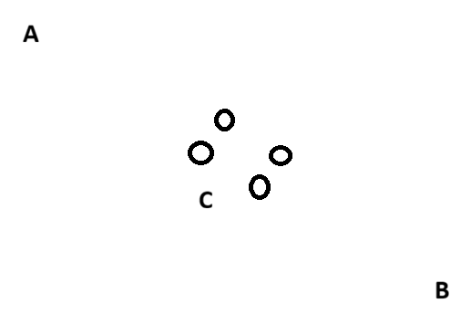

# Mining

## Basic Deposits (over earth)
### Test 1 - Ore Nodes (over earth)
**Intention**  
Do ore nodes spawn a bit randomly or is the amount of over earth nodes fixed?

**Test Setup** 
1) Did 3x start a new game.
2) walked east from starting point to the closest 3 deposits (copper)
3) Counted the number of ore nodes/rocks

**Resulting Data:**
Rep | Deposit A | Deposit B | Deposit C 
--- | ---       | ---       | ---
1   |    3      |    2      |  4
2   |    3      |    2      |  4
3   |    3      |    2      |  4

Could not see any variation. Even the visual rock variant was always the same. (But technically they don't seem to make a difference, it's only aestetics if it's a large or smaller rock)

### Test 2 - Player Mining (Tin)
**Intention** 
- Mining as player in order to check the number of hits needed to remove a tin rock 
- Count the ore yield per node. What can be expected on average.
- Is there a difference between small and big rocks?

**Test Setup** 
- Using the tin deposit close to the hanging bodies tree near Farnsworth.
- Mine large and small rocks and get the output.
- Automatic counting of hits via a click counter. Still the numbers will be a bit unprecise bc you might miss or click too fast.

**Results** 
Rep | Small Rock        | Large Rock
--- |---                | ---
1   | 54 ore / 54 stone | 68 ore / 58 stone
2   | 75 ore / 48 stone (same stone as 1) | 64 ore / 59 stone
3   | 73 ore / 48 stone | 59 ore / 55 stone

The whole deposit (5 nodes) gave **318 ore and 273 stone alltogether**. Above was done AFK so hit counting was not possible. Sadly auto-clicker did not properly work.

Hit counting:  
Rep | Hits | Yield | Type
--- |---   | --- | -- 
1   | 910  | 58 ore / 46 stone | Copper
2   | 900  | - | Tin
3   | 911  | - | Tin

Tin and copper seem to take the same amount of hits. Counting could have been quite bad and actually a static number around 900 might be correct.

### Test 3 - NPC Mining
**Intention**  
Is there any significant difference in player or NPC mining? Yield, speed, etc..?

**Test Setup** 
- Using the tin deposit close to the hanging bodies tree near Farnsworth.
- 5 Companions were ordered to mine (assuption companion mining = worker mining)
- What is the overall yield? (Expect about 318 from last time)

**Results**  
NPCs seem to get the same yield as the player (but only one run).
Yield was **332 ore and 247 stone** over all.

## ModKit Data 1 - xxx_NodeParent_MineHarvest
**Intention**  
Check ModKit for data on mining and align it with the experimental findings. This might help avoid needing more tests (current number of tests is not sufficient).

**Results**  
The blueprint classes `<metaltype>_NodeParent_MineHarvest` (searching in ModKits content drawer gives 8 blueprints) for all existing metal types and granite and even more (nickel, rock walls, stone...) seem to give the relevant data as a kind of 'mining behavior'-definition classes.

They all inherit from "Rock Mine Harvest" indicating ore mining is just a specialization of rock mining.

The data:  
Tin and copper form one group of behavior while iron and granite form another. Data within each group is identical except for the type of ore.

Tin And Copper:  
  - define a number 907 for "Max Outputs". This aligns with the ~900 hits we found before.
  - 2 resource entries are defined: tin/copper ore and crude stone
  - Tool level is 1 (likely tier 1)
  - Tool level chance bonus is 0.0 (so no bonus at higher tool tier)
  - 3 xp for copper/tin ore
  - 1 xp for crude stone
  - Tool durability damage: 1
  - min/max quantity for ore and stone is 1 (when getting an output it's always just one without harvesting bonus)
  - chance for copper: 0.065 and for stone: 0.050

Iron And Granite:  
  - define a number 3142 for "Max Outputs".
  - 2 resource entries are defined: iron/granite ore and crude stone
  - Tool level is 2 (likely tier 2)
  - Tool level chance bonus is 0.0 (so no bonus at higher tool tier)
  - 3 xp for iron/granite ore
  - 1 xp for crude stone
  - Tool durability damage: 2
  - min/max quantity for ore and stone is 1 again
  - chance for iron/granite: 0.105 and for stone: 0.030

## Pit Mining
I'm a software engineer for business software but 100% a noob on Unreal Editor and ModKit. As far as my search brought me in ModKit it seemed to me that pit mining was not really opened for modders and thus sadly not inspectable for me. So testing was needed to geather more information about pit mining.

### Test 1 - Full depletion
**Intention**  
What is the basic effect of full depletion?

**Test Setup** 
1) Have as many pits as possible on a single deposit (for higher speed)
2) Harvesed with all pits, 9 workers. Their harvesting skill was not controlled for this test (ranged from 4-10).
3) Count amount of ore that can be harvested until depletion
4) Check: What happens if "Mining Capacity" reaches 0%? (was not yet possible bc of save/load-resetting capacity bug)

**Results**  
- Once a pit reaches 0% of an ore it says "depleted" and workers can't mine it anymore

- Building new pits at that deposit after depletion doesn't change that

- The total ore count for copper was 1228 at the deposit at the bridge in 'Sunnyside Plains'. Additionaly 1177 stone were harvested. This run the 'nearby resources' were 4.

- [after later findings] The amount is about 307 per underground node. That is about 5 times the expected amount of your average over earth node (59 ores).

### Test 2 - Nearby Resources 1
**Intention**  
What is 'nearby resources' before placing a pit? Hunch: Could it be 1:1 related to the overgound nodes?

**Test Setup** 
- Revisit the 3 copper deposits from "Basic Deposits - Test 1"
- Include copper deposit from "Pits - Test 1" as deposit D
- Include the huge copper deposit from the very north of Hearndean as deposit E
- Check each deposit with a pit building for 'nearby resources' and keep track of the amount shown.

**Results**  
Deposit | Over earth nodes | 'nearby resources' 
---     | ---              | ---       
A       |    3             |    3      
B       |    2             |    2      
C       |    4             |    4    
D       |    4             |    4
E       |   11             |   11

So over earth nodes were always the same number as 'nearby resources'.  Especially the clear difference between C,D vs E makes it very plausible that 'nearby resources' = amount of nodes. Still: It could theoretically be chance as there is only a single value for each deposit.

### Test 3 - Nearby Resources 2
**Intention**  
Try verify the hypothesis you'd automatically get from "Pits - Test 2" (overground node = underground nodes = 'nearby resources') with a smart qualitative experiment rather than endless repetitions for good qunatitative statistical numbers.

**Test Setup** 
- Copper deposit at the bridge at 'Sunnyside Plains' 
- Place two pits (A and B) on two opposing ends of the same deposit
- For the placement I tried to make it so that each pit is positioned so that you could tell that 2 overground nodes were clearly closer to them than the other two (see picture below)
- Each pit should say 'nearby resources' 2 for copper before placing
- Let NPCs mine in just pit A

Placement of pits A, B and C:

**Results**  
 - while mining capacity % went down in pit A they remained at 100% in pit B (which was not operated)
 
 **Extension of this test**  
 - Let NPCs mine only in pit A to 'mining capacity' 80%, while pit B still had 100%
 - Added a third pit C close to all 4 nodes and with 'nearby resources' saying '4'
 - Result: When pit C is built it has 'mining capacity 90%' from the start. 

- Pits seem to use the former overground nodes or their position (or have sth invisible placed near the former overground nodes) that indicates underground nodes in the same number as overground nodes. These underground nodes can be depleted independently from each other 

### Test 4 - Yield for iron
**Intention**  
Bc ModKit could not be inspected for max yield numbers of pits this must be tested.

**Test Setup** 
- took me about 4-6 hrs (incl. setting up a village and storage)
- North of the small lake in Deerfield a deposit with 4 iron node is used
- 3 pits with 9 NPC with 0 harvesting max skill, and strength 2 (for sturdy pickaxe) are constructed 
- make sure to have enough storage, bc 
- each night the total ore gathered and the capacity is saved

**Results**  
Day | Ore      | Capcaity
--- |---       |---
1 | 42         |  98%
2 | 131        |  96%
3 | 203        |  95%
4 | 310        |  93%
5 | 376        |  91%
6 | 518        |  89%
7 | 550        |  87%
8 | 607        |  86%
9 | 651        |  84%
10|  685       |  83%
11|  735       |  82%
12|  772       |  81%
13|  814       |  79%
14|  853       |  77%
15|  901       |  76%
16|  928       |  75%
17|  949       |  73%
18|  1014      |  72%
19|  1055      |  70%
some pickaxes were missing till now 
20 | 1100      |  69%
21 | 1124      |  68%
22 | 1182      |  67%
23 | 1241      |  65%
24 | 1302      |  64%
error measuring ores: big part of ores were not correctly measures because they were "waiting for transport"
added 3 delivery villagers to the 9 miners and continued test
25 | 1314       | 63%
added big backpacks to every worker for better transport/delivery
26 | 1641      | 61%
27 | 1693      | 59%
28 | 2437      | 55% 
still correcting delivery storage, there was a lot clogged up
29 | 2699      | 52%
30 | 3177      | 49%
31 | 3346      | 45%
32 | 3597      | 41%
added 3 more delivery guys
33 | 3804      | 38%
34 | 3925      | 36%
35 | 4127      | 33%
36 | 4414      | 31%
37 | 4434      | 29%
38 | 4658      | 26%
39 | 4853      | 22%
40 | 5071      | 20%
41 | 4977      | 18%
42 | 5093      | 16%
43 | 5116      | 13%
44 | 5386      | 10%
45 | 5564      | 8%
46 | 5594      | 6%
47 | 5638      | 4%
48 | 5672      | 4%
49 | 6262      | 1%
50 | 6306      | depleted

NOTE:  
Here I've found a discrepancy between the pits statistics page displaying the overall produced ore (it was only 5752 ore there so 554 is missing) and the one I had in storage. Ore was solely generated by NPCs underground mining.

**Basic evaluation of the numbers:**  
- The numbers show an increase of almost 5 time over the normal overground nodes. Overground nodes give about ~330 ore on avg. here we had 1577 ores per node (average over the 4 underground nodes) which is **about 4.8 times the overground amount**.

- Daily output is hard to identify between each measure point bc during the test many soft issues came up that affected the counting. Initially only the number of produced ores was collected from the pit till day 25. This number however ignores ore that waits for transport (e.g. from the pit storage away). So depending on the delivery performance this number varied strongly. It seemed like the use of "AdvanceTime" cheat somehow impacted deliveries negatively (somehow they were carried out to a certain degree but it went significantly better when just letting the game progress normally) so this became an issue even with 6 delivery NPCs with big backpacks.
For a better approach I'd simply devide the 6306 ores by 50 days giving a **production of 126 ores a day or 42 per pit with 3 NPCs**. Curde stone production is always a bit lower than that (about 30/day but wasn't properly measured).
- In regard to deppletion percentage you get 2% for 3 pits on 4 nodes. So for a single but fully operated pit I would calculate **2% / 3 * 4 = 2.67% a day mining capacity removal for a single node**.  
*NOTE:*   
During the test run mining was blocked partially on a couple of days (missing pickaxes and clogged storage). I think these issues were only brief and quickly resolved.

Interpretations:  
- These number should be a lower limit bc of the NPCs being harvesting 0. Another run should be done with harvesting 5 to get a average case scenario. I'd say lvl 10 might not be super relevant bc you have those NPC less often.

I would expect that this 2.67% removal per day is equally distributed over all nodes. If you have a two node pit (iron/granite) I'd expect 2.67% / 2 = 1.33% per day removal. Another number one might better grasp: a single fully operated pit will on average always produce about 42 ores and should need 150 days to deplete a 4 nodes deposit. Or 37.5 days for a single node. => TODO: calc node number to days factor