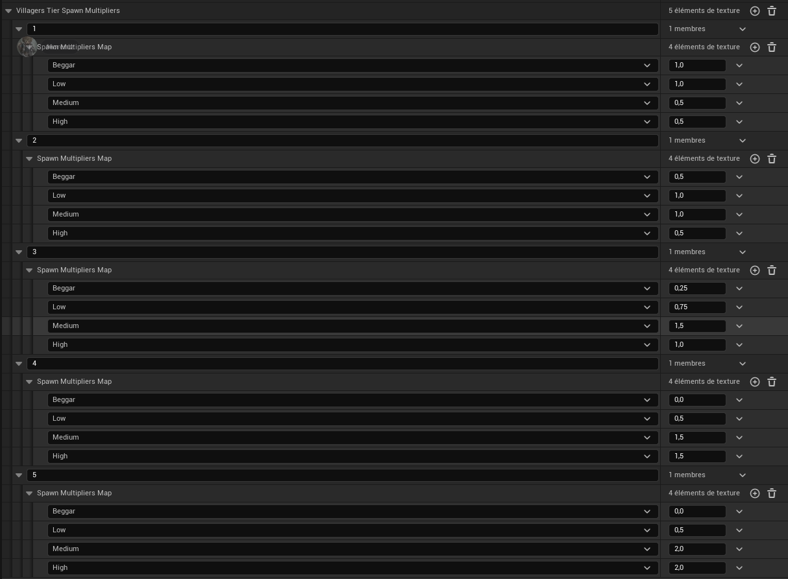
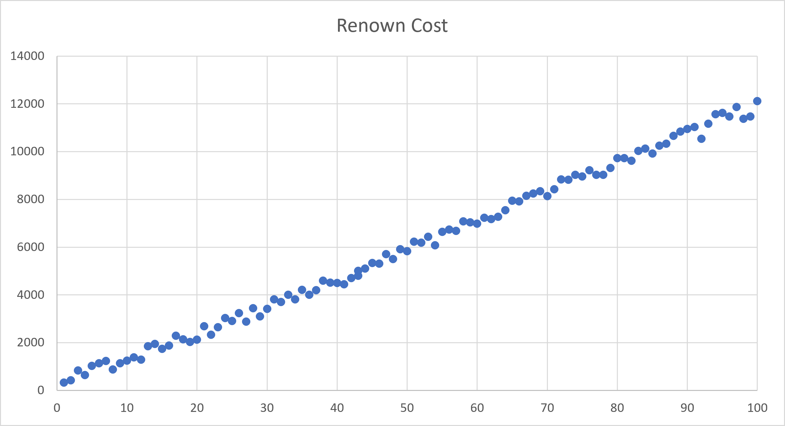

# Villages (data)

## Data 1 - Modkit: Prosperity progression
From modkit one gets the following info about villager tier spawn multiplier *(thanks to Morentz!)*

The whole population gets fixed factors/percentages for each villager quality.

Prosperity | sum | Beggars | 1 star | 2 star | 3 star
---        | --- | ---     | ---    | ---    | ---
1          | 3   | 1       | 1      | 0.5    | 0.5
2          | 3   | 0.5     | 1      | 1      | 0.5
3          | 3.5 | 0.25    | 0.75   | 1.5    | 1
4          | 3.5 | 0       | 0.5    | 1.5    | 1.5
5          | 4.5 | 0       | 0.5    | 2      | 2

So starting at prosperity 3, the number of 3-star villagers should be doubled. Also you can see that the over all number of villagers will increases a bit with higher prosperity (check the sum column).

## Test 1 - Effects of 'Rebellion failed'
**Intention:**  
What happens to village prosperity and facilities after brigands reclaimed a village?

**Test setup:**  
Let a reclamation party take a village. Before they arrive make sure to note the exact prosperity, village buildings (added from the player) and all facilities of a village. Make sure to add houses to every village. Let the brigands take the village. And wait 4 in game days. Reclaim the village and check again what change due to the brigands influence.

**Results:**  
**Before Reclamation:**  
- Prosperity 73,064
- Buildings: Lookout, House
- Facilities
   - 1x Advanced Toolmaker
   - 1x Apiary
   - 1x Bakery
   - 3x Compost Pile
   - 2x Digger
   - 10x Farm
   - 1x Forager
   - 1x Heavy Infantry Militia
   - 1x Herbalist
   - 4x Mixing Bucket
   - 10x Quarry
   - 1x Saw Pit
   - 8x Thresher
   - 1x Windmill

**After Re-Liberation 5 days later :**  
- Prosperity 71,182
- Buildings: Lookout, House (still present)
- Facilities
   - 1x Advanced Toolmaker
   - 1x Apiary
   - 2x Bakery (1x was added!)
   - 3x Compost Pile
   - 3x Digger (1x was added!)
   - 10x Farm
   - 2x Forager (1x was added!)
   - 1x Heavy Infantry Militia
   - 1x Herbalist
   - 4x Mixing Bucket
   - 10x Quarry
   - 1x Saw Pit
   - 8x Thresher
   - 1x Windmill

**Evaluation:**  
- Prosperity sunk about 1800 within 4 days
- The battle did cost about 300 prosperity due to lost militia (which is like nothing)
- Village buildings were kept and esp. the number of villagers stayed the same over the whole time (29 before, in between and after re-liberation).
- 3 Facilities were even added under the brigands rule
- Trust stayed at the level before liberation and thus the village was able to be immediately re-liberated
- No renown was lost

**Conclusion:**  
**Facilities and Village Buildings:**  
Nothing was destroyed, they even kept building. Regarding village buildings, only the belltower will be destroyed, all other kinds of buildings are kept.

**Prosperity:**  
Besides the low prosperity cost because of the battle, prosperity did turn downwards more (about 1800) although it was normally rising every day by about 400 before reclamation. So occupied villages seem to inadvertently lose prosperity but relatively slowly. Prosperity does not immediately crash and a change of about 400-500 day is relatively mild on prosperity level 4. 

**Other Effects:**  
While the brigands are back you can basically use the village as before, do quests, buy from merchants. The brigand town guards will not attack you (unless provoked) but will fight bandits.

**Bottom line:**  
A "crushed rebellion" doesn't seem so bad. Perhaps we might even have here a super effective way for farming renown: Ashbournes Castle is filled with brigands after every reclamation. The actual reclamation party can be defeated after the "rebellion was crushed" and will not change this state. Afterwards a second battle at Ashbournes Castle should be possible (another ~5,000 renown). Now build another belltower and ring the bell to fight the brigands a third time. A fourth battle now again in the castle might be possible (this last one is not yet tested). All together might be about 20,000 renown.

## Test 2 - Caravans and Prosperity
**Intention:**  
How many carts do villages have at certain prosperity stages? The community already gave the hypothesis that at prosperity 1 they have 1 cart and this increases with each prosperity stage by another cart.

**Test setup:**  
For testing it is not easily possible to identify which cart belongs to which village. But it is do able to get the total number of all village carts in Karvenia. So we could use that and at least two different prosperity states of villages. At least one state should have a mix of villages with different prosperity.

Measuring all village carts in Karvenia:  
Use the cheats: "Slomo 0" and "RevealMapFog". This stops time and shows all individual village carts on the map (as carts without the orange glow given to player carts). The stopped time allows to count a large number of carts manually on the map while they are not moving.

Have two measure points:  
1. Start a new game and measure the total amount of carts in this stage. The expected total number of carts in this stage **would be 7**.
2. Use a 2nd late game save. I had a late game save with prosperity 5 for Horndean and Padstow, all others at prosperity 4. This state should give an **expected total number of 30 carts**.

**Results:**  
1. New game: Was easy to count. **7 carts could be counted**
2. In order to count properly carts were counted per region. I got:
   - Willowbrook: 1
   - Oakridge: 2
   - Ss. Plains: 1
   - Ceedar Creek: 4
   - Northwood: 1
   - Rocky Hollow: 1
   - Riverstone: 1
   - Brightwater: 1
   - Eastfield: 3
   - Fernhill: 1
   - Highland Grove: 3
   - Silver Ridge: 3
   - Stuck in the water to Crasmere: 3
   - Bright Vale: 1
   - Morningstar Hills: 1
   - Sable Creek: 2
   - Whispering Pines 1

   **Giving a total of 30**

**Conclusion:**  
The results indicate that the hypothesis is very likely to be true. The numbers precisely fit to what would be predicted according to that rule and this way testing can be quickly repeated if the rule changes.

## Test 3 - Village Population Development
**Intention:**  
How can a villages NPC composition be changed? We roughly know that village houses add two new settlers and from Data 1 we know that prosperity should also increase and improve the NPC population and their star/quality distribution (to better villagers).

**Test setup:**  
Check the entire population of Karvenia at start of a new game, and at a later stage with all villages above prosperity 4 and some at 5. Additionally take one village with maximum prosperity (best distribution of higher skilled villagers) and build as many village houses as possible.

**Results:**  
1) Influence of Prosperity

   Apprentices at game start (Prosperity 1 = P1):  
   Village        | 3 Star Apprentices                  | 4 Star Apprentices
   ---            | ---                                 | ---
   Hearndean (P1) | 1x Farmer, 1x Weaver, 1x Blacksmith | 1x Weaver, 1x Farmer
   Padstow   (P1) | 2x Carpenter, 2x Woodsman           | 2x Woodsman, 1x Carpenter
   Bradford  (P1) | 1x Woodsman, 1x Innkeeper, 1x Healer| 1x Woodsman, 1x Innkeeper, 1x Healer
   Farnworth (P1) | 2x Weaver, 1x Labourer, 1x Healer   | 1x Labourer, 1x Weaver, 1x Healer
   Blackridgepool (P1) | 1x Labourer, 1x Farmer, 1x Carpenter| 2x Farmer, 1x Labourer, 1x Carpenter, 1x Blacksmith
   Horndean  (P1) | 2x Blacksmith, 2x Engineer, 1x Woodsman| 1x Blacksmith, 1x Engineer, 1x Healer
   Crasmere  (P1) | 2x Labourer, 2x Engineer, 1x Innkeeper| 2x Engineer, 2x Labourer, 1x Innkeeper

   Apprentices late game (Prosperity 4 = P4, and so on):  
   Hearndean (P4), Padstow (P5), Bradford (P4), Farnworth (P4), Blackridgepool (P4), Horndean (P5), Crasmere (P4)  
   were all exactly the same number as at game start.

2) Influence of houses:  
   Padstow at P5 was picked and 6 houses build (+12 villagers). Initially it had already 1 house and population was at 25 and it went up to 37. The population appeared quicker but I waited for 10 min per expected villager (120 min) to be sure the population was upgraded.

   Padstow:

   Star Rating |  P1 Start | P5 + 1 House | P5 + 7 Houses
   ---         | ---  | ---    | ---
   0           |  3   | 0      | 0
   1           |  3   | 2      | 2
   2           |  3   | 11     | 20
   3           |  1   | 5      | 8
   3, apprentice|  4   | 4      | 4
   4           |  3   | 3      | 3
    |
   Total       |  17  | 25     | 37
   
   I couldn't find any change in apprentices, so the seemingly fixed 3-stars: 2x Carpenter, 2x Woodsman and 4-stars: 2x Woodsman, 1x Carpenter. So even this did not add any 4 star villager. Moreover only 3 3-stars were added. A player might not chose below 3-stars.

**Conclusion:**  
Neither prosperity nor houses improved the amount of 3-stars efficiently.The number of 4-stars can't be affected at all. House increased the amount of 2-star villagers the most even when the village was at prosperity 5.

Also an increase of 4-star villagers was not possible.

Players mostly (and should) recruit 4-star or at worst non apprentice 3-star NPCs for the late early to end game. That's because renown cost of 4-stars to 0-stars is so close. Lower tier NPCs should rather serve as 'temps' that are expelled as soon as possible. However none of the two mechanisms (houses and prosperity) provide any meaningful help in recruitment of the relevant NPC quality.

## Test 4 - Renown Cost 1 - Impact of NPC Quality
**Intention:**  
How strong are the differences in renown cost early and late game in regard to villager quality?

**Test setup:**  
Create a new game ('Early', 0 NPCs) and try recruiting. Use a late game ('Late') save with a total of 106 NPCs and 16 NPCs from that village and to do the same.

**Results:**  
- Renown Costs (raw data)
   Villager stars | \| | 'Early'    | \| | 'Late'
   ---            | -- | ---        | -- | ---
   1              |\|  | 78, 73, 83 |\|  | 13121, 13121
   2              |\|  | 173, 183   |\|  | 13226, 13221
   3              |\|  | 333        |\|  | 13381, 13381
   3 (apprentices)|\|  | 478, 493   |\|  | 13531, 13531
   4              |\|  | 493, 633   |\|  | 13686, 13686

- Derived: Cost factor in relation to 1-star (cheapest) based on averages.

   Villager stars | \|  | 'Early' (avg) | \|  | 'Early' (Factor) | \|  | 'Late' (avg) | \|  | 'Late' (Factor)
   ---            | --- | ---           | --- | ---              | --- | ---          | --- | --- 
   1              | \|  | 78            | \|  | 1.00x            | \|  | 13121        | \|  | 1.00x     
   2              | \|  | 178           | \|  | 2.28x            | \|  | 13224        | \|  | 1.01x     
   3              | \|  | 333           | \|  | 4.27x            | \|  | 13381        | \|  | 1.02x     
   3 (apprentices)| \|  | 486           | \|  | 6.23x            | \|  | 13531        | \|  | 1.03x     
   4              | \|  | 563           | \|  | 7.22x            | \|  | 13686        | \|  | 1.04x     

**Conclusion:**  
Early on (0 NPCs) the hiring cost increases by quality alone with a factor of up to 7.22 while in the late game the renown biggest cost difference is just about 1% to 4%.

We assume that the average cost for the early hires gives a constant base cost, that is simply added. Supporting are the cost differences to the 1-star NPC:  
   Villager stars  | 'Early' (avg)  | Difference to 1-star  | 'Late' (avg) | Difference to 1-star 
   ---             | ---            | ---                   | ---          | ---                  
   1               | 78             | 0                     |  13121       | 0                     
   2               | 178            | 100                   |  13224       | 103                   
   3               | 333            | 255                   |  13381       | 260                   
   3 (apprentices) | 486            | 408                   |  13531       | 410                   
   4               | 563            | 485                   |  13686       | 565                   

The differences are very similar for both cases. Also seem to be a fixed price that will later be irrelevant. There is still some variance probably due to actual stats of each individual so we use these fixed values just as a rough guidance for further calculations.

We call these quality base values `B`:
Quality           | Avg. Quality Base Value (B)
---               | ---
1-star            | 78 
2-star            | 178
3-star            | 333
3-star apprentice | 486
4-star            | 563

## Test 5 - Renown Cost 2 - Impact of Imbalanced Hiring
**Intention:**  
When hiring from only one village players see a visible increase in hiring cost. How large is that effect compared to a village you don't have any hire from?  
Again also compare an early game scenario with a late game scenario.

**Test setup:**  
We have hiring cost increases due to the total number of recruits (`N`) and due to the number of recruits from a single village (`k`). Here we need to eliminate the impact of `N`. We want to compare the cost of hiring while `k` is one of `[0, 4, 8, 12]` in 'Village X'. For eliminating the total count effect, we make sure that when testing each case of `k` we always have the same total `N` by having NPCs from other villages.

For an early game scenario we keep `N=12`. We also test an additional late game scenario were we keep `N=100`.

To measure the renown cost we try to hire a normal 3-star villager. Also the `k`-NPCs (already hired in village X) should all be 3-star villagers to reduce the NPC quality effect and also because 3-star villagers are available in good numbers.

**Results:**  
Scenario | Total NPCs (N) | NPCs from other villages | NPCs from Village X (k) | Cost for the next hire | Difference to first
---      |---             | ---                      | ---                     | ---    | ---
| Early Game:                                                                           
E1       | 12             | 12                       | 0                       | 1528   | 0
E2       | 12             | 8                        | 4                       | 1708   | 180
E3       | 12             | 4                        | 8                       | 2191   | 663
E4       | 12             | 0                        | 12                      | 2937   | 1409
| Late Game:                                                                               
L1       | 100            | 100                      | 0                       | 10333  | 0
L2       | 100            | 96                       | 4                       | 10513  | 180
L3       | 100            | 92                       | 8                       | 10981  | 648
L4       | 100            | 88                       | 12                      | 11737  | 1404

**Conclusion:**  
Mathematically we see that the differences are about the same for `N=12` and `N=100`. This indicates the k related term:  

a) Is just added to the N related term  
b) Is independent of other state and only depends on hires in Village X

Letting claude code Opus 5 high run a fitting on the data I get a pretty perfect fit for calculating the increase due to existing village hires `k`:  
`Per Village Extra = 9·k·(k+1)`

Practical Consequences:  
Early game the impact of hiring in a single village is very strong: Having already 12 NPCs, the 13th hire from the same village almost costs 100% (92,2% exactly) more than the first.

Late game the effect is much weaker for 12 hires but can still be felt with 13.6%. However at 100 NPCs we need about 14 to 15 NPCs per village. This means actually 12 NPCs from one village would actually be considered under hiring from that village. Over hiring at 100 `N` would be in the range range of 30 hires from one village and leaving out another village completely. Since the found formula scales quadratic, the impact might still be strong at `N=100`.

## Test 6 - Renown Cost 3 - Large Example of Imbalanced Hiring
**Intention:**  
In how much extra renown does it cost in the end game when hiring overly from a single village while leaving another out completely? 

**Test setup:**  
Start with `N` (total number of your NPCs) at 100 and a balanced hiring (so from 5 villages 14 NPCs and from 2 villages 15). Note the current remaining renown as the well balanced.

Over all further tests keep the number `N` at 100 by firing NPCs that come from village B and only hire further NPC from village A. The idea is that village B has 0 NPCs hired by the player at the end and village A has 30. Note the remaining renown of this end state.

Additionally note the individual hiring cost while increasing the head count from A.

Repeat with a mid game example of `N=50`. We'd expect balanced hiring at `k` being 7-8 NPCs per village. So from the imbalanced village we hire 14. 

**Results:**  
Sample | k (village A) | k (village B) | cost of next hire in A | remaining renown
---    | ---           | ---           | ---               | ---
| `N=100`
1      | 15            | 15            | 12492             | 143664
2      | 16            | 14            | 12781             | -
3      | 20            | 10            | 14113             | -
4      | 24            | 6             | 15733             | -
5      | 28            | 2             | 17636             | -
6      | 30            | 0             | 18063             | 82914
| `N=50`
7      | 7             | 7             | -                 | 590160
8      | 14            | 0             | -                 | 583991

Renown differences imbalanced vs balanced:  
- `N=100`: 60750 (about 4-5 NPCs)
- `N=50`: 6169 (1 NPC)

**Conclusion:**  
The 'cost of next hire' develops roughly as predicted by `9·k·(k+1)`. More importantly at these higher numbers of `k=30` the impact is much more noticeable than `k=12` from the test before. Even for `N=100`. We see this also by the difference in total renown spending which is best measured via number of NPCs. At that stage this is about 4 to 5 more NPCs which is a relevant number (a full outpost).

At the same time `N=50` with a imbalanced `k=14` it overall is not having much of an effect only costing us 1 additional NPCs (average cost for one NPC was at about 4800).

## Test 7 - Renown Cost 4 - Total Number of NPCs
**Intention:**  
Get a curve for the renown scaling based on the total population excluding all other factors. The total count based scaling seems to be the most important one a player should understand what the scaling curve looks like.

**Test setup:**  
For excluding effects based on NPC quality we again use the 3-star NPCs. Also because they are better available than the 4-stars. To reduce the effect of `k` (NPCs hired in a village) we try to get recruits in such a way that the villages are always balanced.

**Results:**  
Data is in the table [villages-test7-results1-100.csv](./villages-test7-results1-100.csv)

Diagram of the 100 data points:

Explanation for the slight variations from a linear progression would be attributed to difference in skill and traits and not all NPCs being 3-star: Some were lower some were better.

Fitting this (used claude AI, Opus 5, high) a linear fit is found to be the most likely one:  
`Cost ≈ 118.79 x Count + 26.65`

However we already know about the term based on `k` (`VillageCost(k)=9·k·(k+1)`). This effect should have been present to a lower degree already in the data but `k` was still relatively low. LLM agents are able to respect this and recalculate the function resulting in a more precise (but still simplified) version of the formula:

`Cost ≈ 100·N + 9·k·(k+1) + B`

So the slope becomes a little less steep and instead the village cost term is added. We also incorporated the quality base value: See the appropriate values for `B` in the last table in *Test 4*.

**Conclusion:**  
Cost seems to develop linearly for lower numbers of `k`. Players should keep `k` low by distributing hiring as much as possible. The NPC quality aspect `B` becomes irrelevant pretty quickly. Now that we have some formulas we might be able say at which head count `N` that might be.

## Test 8 - Rerolling Villagers
**Intention:**  

**Test setup:**  

**Results:**  

**Conclusion:**  
