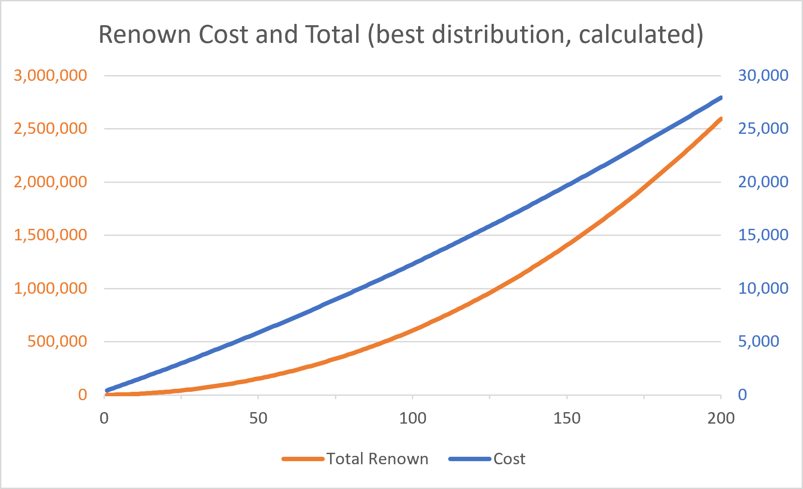

# Controllable NPCs
These interpretations about 'Controllable NPCs' are based on:
- [Player controlled NPCs (Data)](../data/players-npcs.data.md).
- [Villages (data)](../data/villages.data.md).

### Hiring  
- Hiring NPCs will require an increasing amount of renown.
- Having many hires from one village increases the renown cost in that location further. The effect is relatively small (observed in a usual playthrough about +10-20%).
- Once an NPC is hired, their village will get a replacement with the same star rating and profession after 10 minutes. If multiple villagers were hired at once the refills will come in a queue one every 10 minutes.
- Expelling an NPC returns all renown to you.
- Expelling an NPC before a replacement can be found in the hireable villagers overview (click the village on the map) will return that villager to that town and he/she can be hired later. However once a replacement exists the expelled villager will be gone forever.
- Besides the village NPCs there are several NPCs that can be hired via quests.

Very recommended on this topic is the [fandom wiki](https://bellwright.fandom.com/wiki/Villagers_for_Hire#Other_Recruits)

### Renown Cost
Via testing it was possible to determine the most important parts of the renown cost calculation. (For details see [Villages (data)](../data/villages.data.md))

Renown prices effectively increase linearly (as long as you hire from all villages and below about 200 NPCs). But the total amount of renown needed scales quadratic because the prices increase linearly.

NOTE:  
Two y-axis are used! Normally 'Cost' would be lying flat on the ground, because its values are much lower than the total renown needed.

The depicted diagram shows a calculation based on the found formula. It assumes ideal hiring which would be always distributing NPC hiring over all 7 villages.

The derived general formula for renown prices is as follows:  

`Cost ≈ 100·N + 9·k·(k+1) + B`

`N` = total number of player NPCs
`k` = number of NPCs hired for this village (where the next hire should be)
`B` = the average NPC quality base value (see table below for possible values)

Quality           | Avg. Quality Base Value (B)
---               | ---
1-star            | 78 
2-star            | 178
3-star            | 333
3-star apprentice | 486
4-star            | 563

#### Optimal Hiring

Base on that formula some data exploration show what would happen on the basis of 100 player NPCs:

Village Hiring Distribution | Total Renown Cost | % vs balanced
---                         | ---               | ---
15,15,14,14,14,14,14        | 599k	            | 0%
30,15,14,14,14,13,0         | 660k              | +10%
20,20,20,20,20,0,0          | 658k              | +10%
50,25,10,5,5,3,2            | 963k              | +61%
100,0,0,0,0,0,0             | 3.54M             |+490%

So optimal hiring (lowest renown cost) is balanced hiring between all 7 villages. Given an optimal distribution claude code was asked to give a function for the hiring cost of the next villager and the total needed renown depending on the total number `N`:

`Cost ≈ (100 + 9/7)·N + (9/49)·N² + B`

(factions are written as they are easier to transfer than endless decimals)

And now the total needed renown at optimal hiring:  
`Total(N) = 3N³/49 + 50N² + (47 + B)·N`

Those are approximations but capture what you'll mostly need. B is probably not fixed and so on. But this should enable you very well to predict the prices and renown you need. 

### "Death" of your NPCs
Also check the traits and injuries in [Buffs and Debuffs](./buffs-debuffs.itrpd.md)

- Workers, guards and companions can be killed. However: the first time this happens it just counts just as being **'knocked out'** and they immediately gain an **'injury'** for 20 minutes.
- NPCs do respawn after exactly 10 minutes in their settlement (where their house/sleeping place is). One can simply check the injury time in the NPCs attributes: if it's down to 10 minutes the NPC 'wakes up' again.
- While 'knocked out' NPCs can't be managed anymore. Books can't be started but already started books continue in this time.
- Injuries give a debuff to speed, damage, yield, productivity etc.
- While NPCs are injured they have a 30% chance of permanent death if they die again.
- NPCs with the **'Nomad' trait** can't be permanently killed. But they do get injured when knocked out.
- NPCs with the **'Neurotic' trait** will always survive their first 'knock out' just as every other NPC but have a 100% perma death chance if killed while injured (Though the trait only say +30% (so 60% with the injury), tests show the chance is actually 100%).
- Renown is returned to the player upon the permanent death of an NPC.
- Item are always kept on the NPC. Meaning when knocked out they keep everything, but the same goes for perma death: they take all their gear to heavens.
- The only time items are dropped upon NPC death, are delivery items while a worker is on a delivery job. Still the gear is kept.

## Worker
- Only pick 1 food while being a worker [TODO:**this claim seems to be wrong. Testing regarding amount of food is planned**]
- Workers only need a sleeping place and food to be ‘happy’ aka: have a good morale. Actual sleep is not required, so it’s okay to have them as companions during the night.
- The sleeping place needs to be of the right tier otherwise they get a debuff. [Need to test: This seems to only affect the main settlement or where a village or town hall is created. In these cases houses would need to be of the tier of that building]
- According to the in-game codex high morale helps to increase "productivity" which is a buff. [TODO: but to what extent? The game does not tell. Morale 50 gives what productivity?]
- Productivity increases the speed of everything that has a process bar [TODO 1: found that about productivity online, reddit, must be verified! but would fit description in-game]
- [TODO 2: why is productivity often different for each work attribute if you hover over them? Prod-Food seems to give a base buff but each attribute seems to have a bigger increase. Perhaps due to the resp. skill lvl?]
- Workers that have "hold ground" enabled will engage in combat and alarm others. **NOTE:** They engage in combat but still normally just take 1 food instead of guards who take 3 foods like companions. [TODO: should these others be reservists or also hold ground? How far away may others be to be recruited? I believe pretty far]
- If a weapon is missing and villagers are attacked: they will run away. That’s terrible when escorting a new recruit home: animals always attack NPCs in your party before you. The recruit will run endlessly in the wrong direction and you after both of them.
- Idle workers will walk alone very far out of your settlement. Basically: If there is any bandit camp nearby (in that county) they are very likely to be attacked
- Workers will automatically pick up dropped loot bags. (if there are close to the settlement, unclear: does the worker simply have to be near or does the loot bag need to be within the settlement aIn the above formula the quadratic term `9·k·(k+1)` already hints that price growth is not strictly linear, but it is mostly for the relevant range. If however `k` grows very high: The whole cost function goes stronger into a quadratic scaling causing players pain when hiring only from a single village as prices will skyrocket.
rea?)

## Guards
- **\[Seems like that is wrong\]** They always try to maintain 3 food
- Guards don’t work but walk around your camp at all times (they don't sleep). They the companion gear preset (needs verification that it is companion preset).
- Once a guard encounters any enemy they automatically call every other guard to assist them no matter how far the others are away (like attacking a single bandit of a bandit camp)
- Need to check: how do guards interact with hold-ground workers?
- Guards wander off like idle villagers
- The wandering of guards is stopped once a wall is built. From then on they mostly walk close to the wall but all guards distribute themselves evenly across the wall.
- From experience: If there are bandit camps close by guards are normally very likely to die bc others come to assist pretty late (does not matter if with or without a wall). Exceptions are if the bandits are super weak compared to the guards or similar things. 
- Guards won’t pick up loot bags of fallen enemies

## Companions
- They always try to maintain 3 food
- Can be ordered to follow you, move to positions, hold ground, charge, or harvest a resource
### Harvesting with companions
- They can’t be used to harvest/ destroy a specific resource. Just try to harvest everything in an area.
- If you want to use companions for harvesting ‘on command’ it’s a good idea to use them during the night. Crafting and researching can only be done by workers during the day but workers will auto sleep during the night. So raising them at night doesn’t cost you production time
